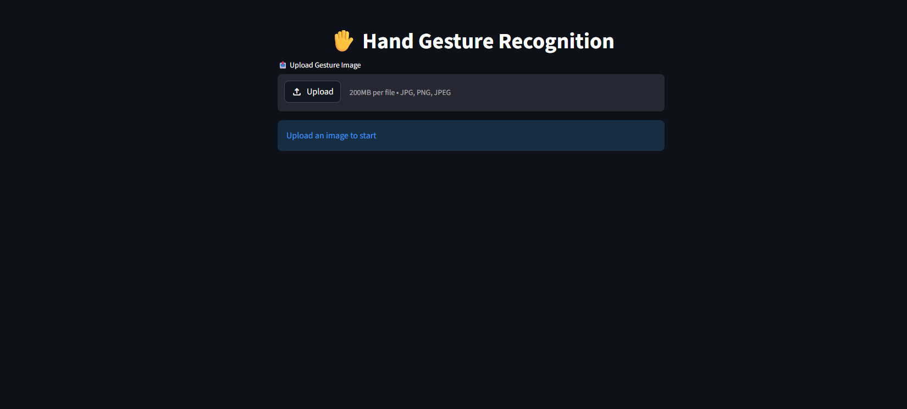

# ✋ Hand Gesture Recognition System.

A deep learning-based hand gesture recognition system that detects and classifies hand gestures from images using **MobileNetV2** and **MediaPipe**, with an interactive UI built using Streamlit.

---

## 🚀 Features

- 🔍 Hand detection using MediaPipe  
- 🧠 Gesture classification using MobileNetV2 (Transfer Learning)  
- 📊 Confidence score with probability breakdown  
- 🖥️ Interactive dashboard using Streamlit  
- ✋ Supports multiple gestures:
  - Palm  
  - Fist  
  - L Sign  
  - Thumb  
  - Index  
  - OK  
  - C Shape  
  - Down  

---

## 🛠️ Tech Stack

- Python  
- TensorFlow / Keras  
- MobileNetV2  
- OpenCV  
- MediaPipe  
- Streamlit  

---

## 📸 Screenshots

### 🖥️ Interface


### ✊ Fist Prediction
.png)

### ✋ Palm Prediction
.png)

### ☝ Index Prediction
.png)

### 👌 OK Prediction
.png)

### 📊 Probability Breakdown
.png)

### 🤏 C Shape Prediction
.png)

---


## 📁 Project Structure
```
hand_gesture_recognition/
│
├── app_streamlit.py
├── train1.py
├── save_labels.py
├── labels.json
│
├── best_gesture_model_mobile.keras
├── screenshots/
│   ├── interface.png
│   ├── fist_prediction(1).png
│   ├── palm_prediction(4).png
│   ├── index_prediction(5).png
│   ├── ok_prediction(2).png
│   ├── ok_prob_breakdown(3).png
│   └── c_prediction(6).png
│
└── leapGestRecog/   (Not included)
```

---

## ⚠️ Note on Dataset & Training Files

The dataset (`leapGestRecog`) is **not included in this repository** due to its large size.

Similarly, full training artifacts and intermediate files are excluded to keep the repository lightweight and easy to clone.

👉 You can:
- Use your own hand gesture dataset  
- Or download similar datasets available online  

---

## ⚙️ How It Works

1. Upload an image using the Streamlit app  
2. MediaPipe detects the hand region  
3. The hand is cropped and resized  
4. MobileNetV2 predicts the gesture  
5. The app displays:
   - Predicted gesture  
   - Confidence score  
   - Probability breakdown  

---

## ▶️ Run Locally

1. Clone the repository  

   git clone https://github.com/yourusername/hand-gesture-recognition.git  
   cd hand-gesture-recognition  

2. Install dependencies  

   pip install -r requirements.txt  

3. Run the app  

   streamlit run app_streamlit.py  

---

## 📊 Model Performance

- Training Accuracy: ~95%  
- Validation Accuracy: ~70–75% 

---

## 📌 Future Improvements

- 🎥 Real-time webcam gesture detection  
- 🎮 Gesture-based system control  
- 🌐 Deployment on cloud  
- 🧠 Improve real-world generalization  

---

## 👩‍💻 Author

**Benita Benny**  


---

